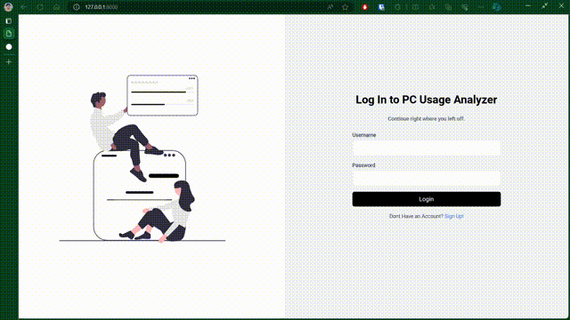
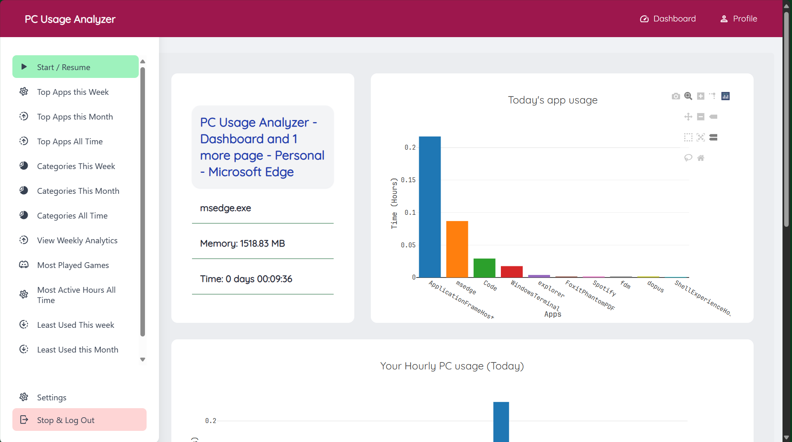
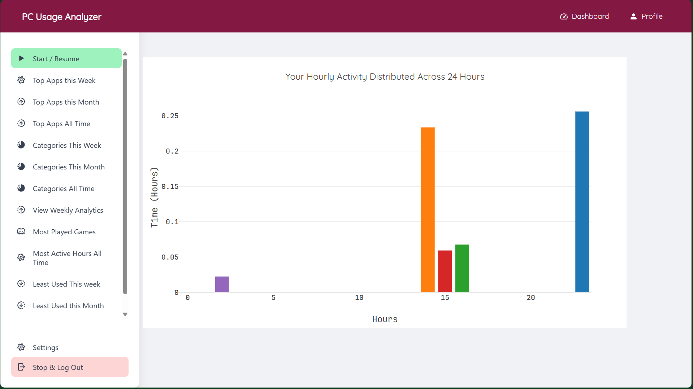
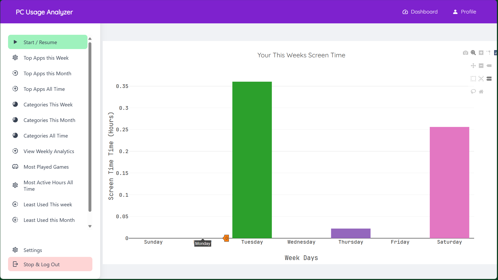
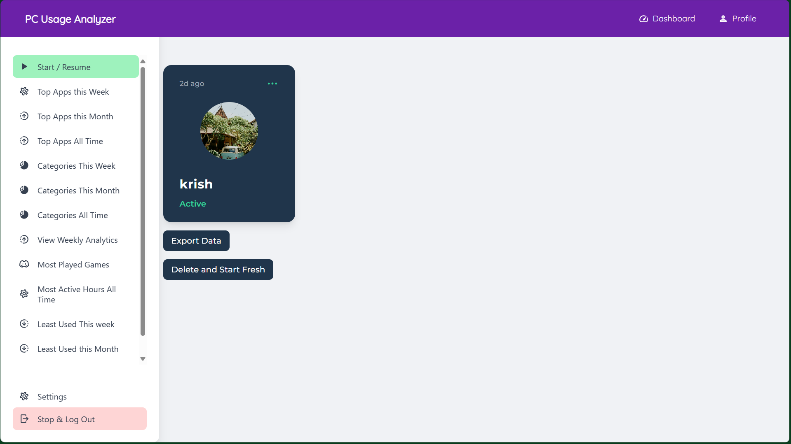

# PC Usage Analyzer

An app to track time spent on each app with ability to export data well for analysis. Also my Data Science Project. The motivation was to track the time I would spend on my PC, and have it stored locally rather than on anyone's server. The app is built using Django and SQLite for the backend, and HTML, CSS and JS for the frontend. The app is built to be run on Localhost, and the data is stored locally on the user's PC. The app is built to be run on Windows only. I couldnt find any other alternative to this so here we are.

## Features

1. Track time spent on each app.
2. Export data to CSV, HTMl and JSON.
3. Analyze data with graphs.
4. Convenient User GUI web app running on Localhost.
5. Analyze time spent each week, month and all time for all apps, in Real Time.

## Screenshots

### DashBoard

### Graphs

### Profile

## Installation and Usage

1. Just download the exe from the releases and run it.
2. Go to C:\Program Files (x86)\Krishnaraj-PC-Usage-Analyzer and run the `gui.exe` file.
3. Click on the `Start` button to launch the app.
4. Go to `localhost:8000` on your browser to view the app.

## Dev Installation

1. Clone the repository.
2. Install the requirements using `pip install -r requirements.txt`.
3. CD into the `PCUsageAnalyzer` directory.
4. Run `python manage.py migrate` to make the databases.
5. Run the server using `python manage.py runserver`.
6. Go to `localhost:8000` on your browser to view the app.

## Todo

- [x] Encrypt the Database using user Credentials.
- [x] Improve Name Display for each program.
- [x] Improve axis ticks for graphs.

## Credits

- The Academind Course to Teach me Django
- Teachers, Parents and Friends, ofcourse, for their neverending support and tolerance to my procrastinations.
